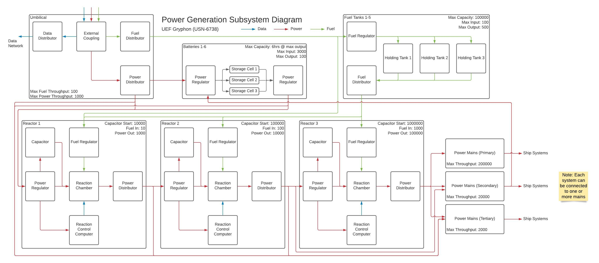

# Power Generation

## Overview
The power generation system provides power to the rest of the ship via the mains. It is composed of several interconnected subsystems: Umbilical, Fuel Tanks, Batteries, and 3 Reactors. The Power Mains are where the power generation system ends and where the Power Distribution System begins.

## Reactors
The ship is powered by 3 Centallium cascading fusion reactors. Due to the enormous initial power requirements to start a full-sized reactor to power the main ship systems, and a desire to provide multiple levels of redundancy, a series of incrementally larger fusion reactors are chained together to provide the initial and ongoing power requirements to each subsequently larger reactor. For example, Reactor 1's initial startup capacitor power requirements can be provided from the Umbilical or a single Battery, and then the power generated from Reactor 1 can quickly provide the intial startup power for Reactor 2, and so on.

Power initially enters the Reactor via the Power Regulator, and is used to prime the Reaction Chamber, charge the Capacitor, and power the Reaction Control Computer. Once the Reaction Chamber is warm and primed and the Capactior is fully charged, fuel is introduced into the Reactor Chamber via the Fuel Regulator and the Reactor is ready to start. The Reactor is powered on by discharging the Capacitor into the Reaction Chamber, and the Reaction Control Computer then balances the incoming power and fuel to sustain the reaction. The generated power then flows into the Power Distributor, where it powers the Reactor, another Reactor, or flows out to another ship's system via one or more Power Mains.

## Batteries
The ship is equipped with 6 battery banks, each of which can supply 6 hours of power at full output. Each battery can be discharged into Reactor 1 or directly into the Tertiary Power Mains. Batteries can be charged from either the Umbilical or directly from the Primary or Secondary Power Mains.

Incoming power flows through the Power Regulator into 3 high capacity solid state Storage Cells. Each Storage Sell is connected to the Power Regulator, which can draw power from one or more cells to provide power out to other parts of the ship.

## Fuel Tanks
The ship is equipped with 5 Fuel Tanks which supply fuel to the Reactors. Fuel flows in from the Umbilical, through the Fuel Regulator, and is stored in Holding Tanks. Each Holding Tank is connected to the Fuel Distributor, which can draw fuel from one or more tanks to provide fuel to one or more reactors.

# Umbilical
The Umbilical connects the ship to an external source and can draw and distribute power, fuel, and data to the ship. The Fuel Distributor is connected to the Fuel Tanks, and the Data Distributor is connected to the ship's Data Network. The Power Distributor is connected to the Batteries, Reactor 1, and the Tertiary Power Mains.